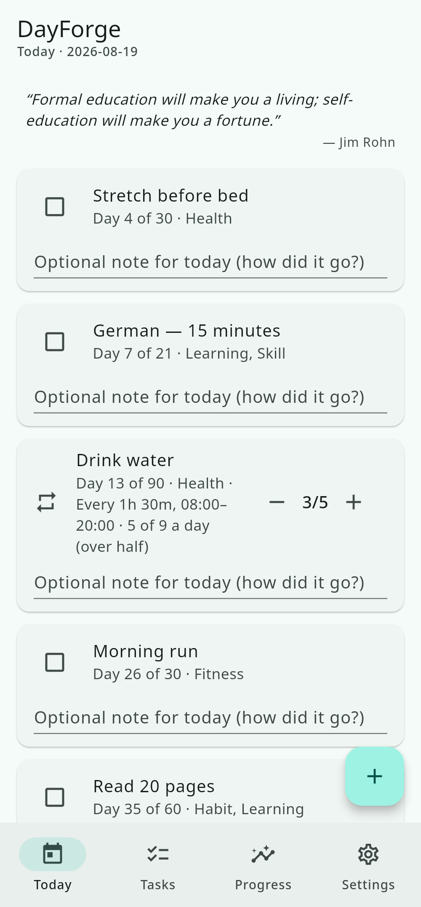
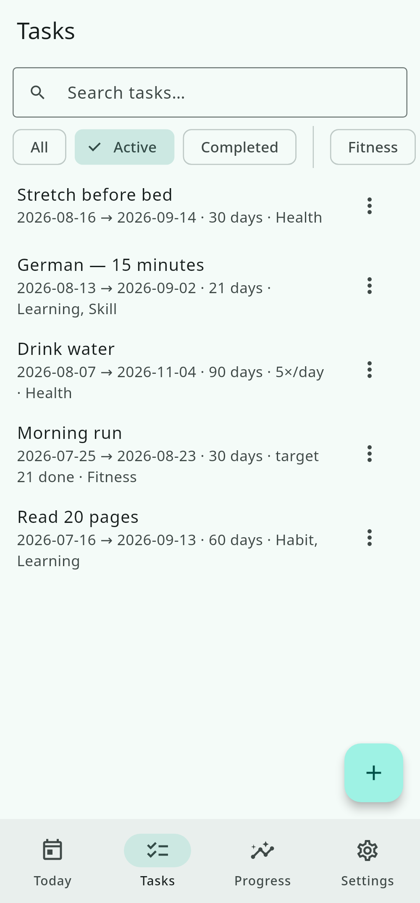
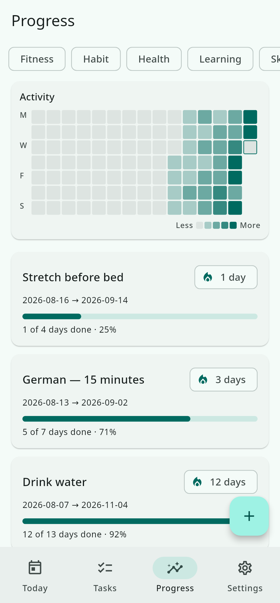
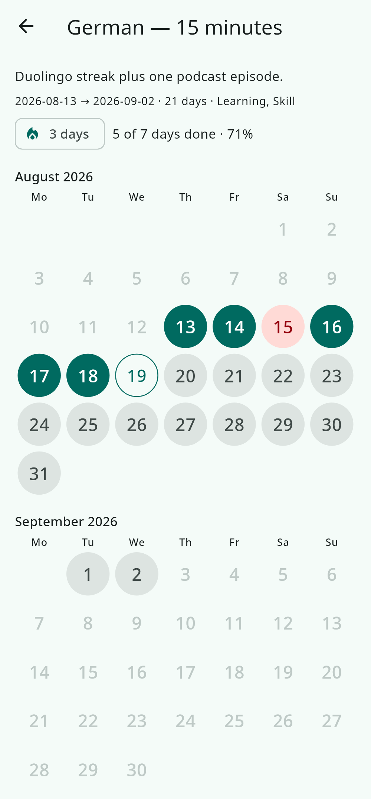
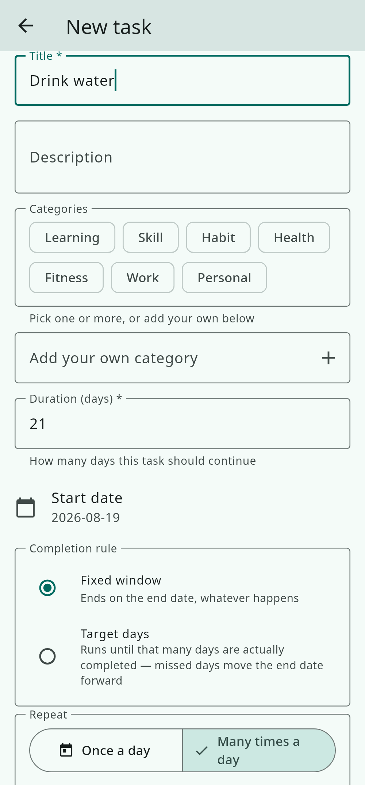
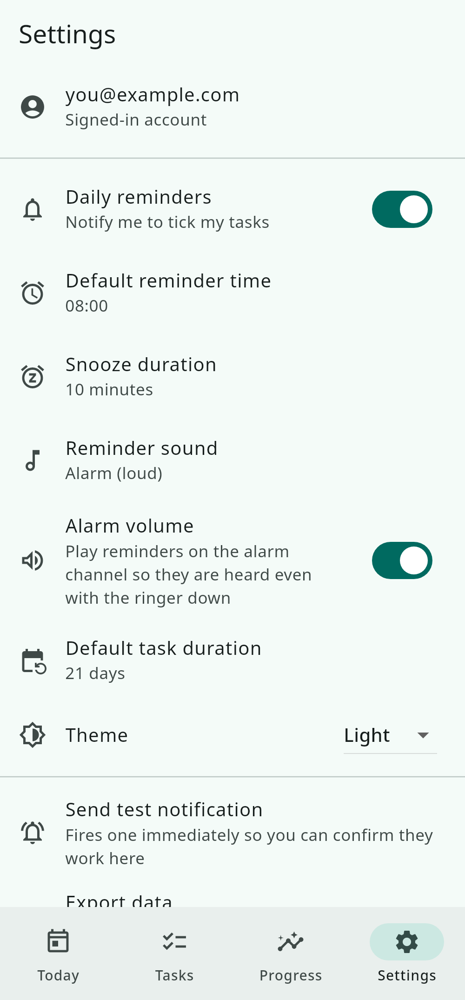
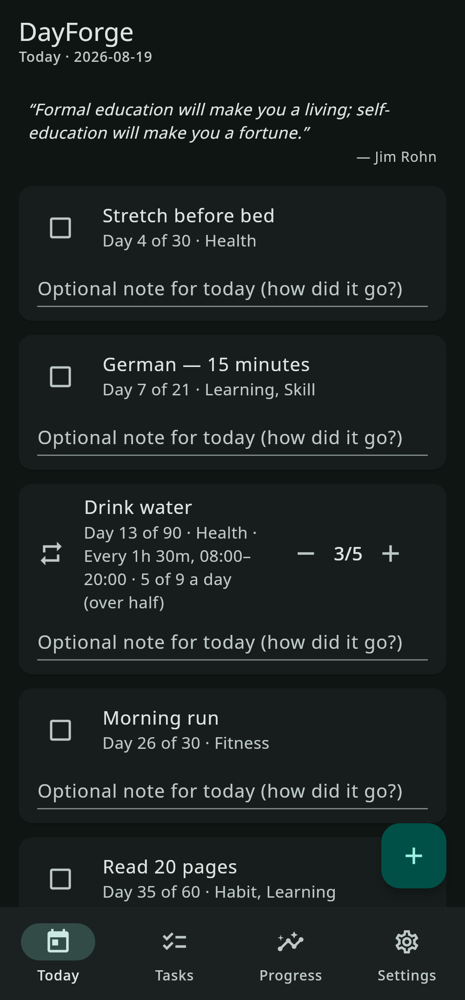
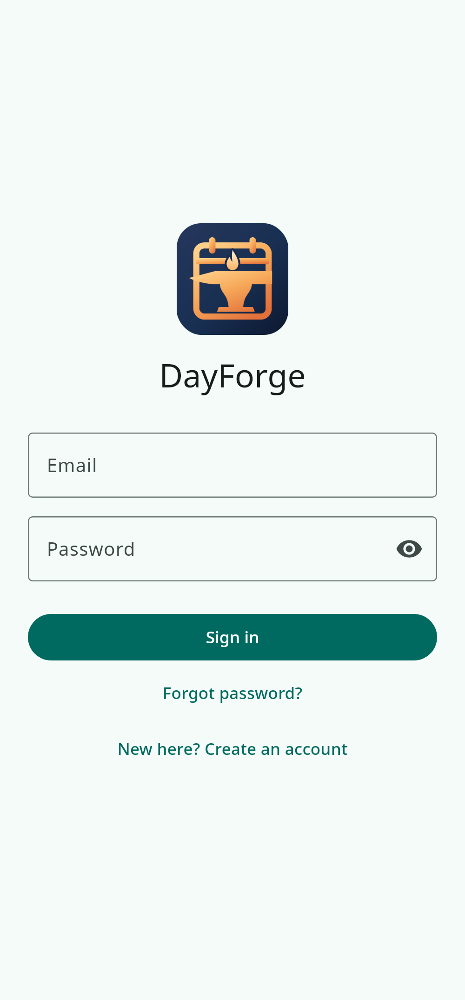
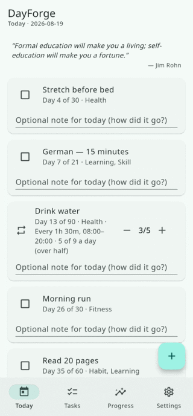

<div align="center">


# DayForge

**Forge daily habits.** A cross-platform recurring-task tracker: add a task once, tick it every day, leave a note, keep the streak — synced across Android, Windows and Linux.


-FFCA28?logo=firebase&logoColor=black)

<br>











</div>

## A day completes on more than half

A task that repeats through the day doesn't demand every single tick. *Drink water* fires nine times; five of them is a strict majority, so the fifth tick completes the day and the card folds away into **Completed today**. Reaching the target doesn't close the counter, though — tick on and a nine-of-nine day is still recorded as nine.

<div align="center">

&nbsp;&nbsp;&nbsp;&nbsp;

</div>

## Features

- **Add a task once, tick it daily.** Set a duration and DayForge generates the days for you — no re-adding, no copying yesterday's list.
- **Repeat many times a day.** A window and an interval ("08:00–20:00, every 90 minutes"), or just say "8 times a day" and let it work out the spacing.
- **The majority rule.** A recurring day completes at more than half its occurrences, so one missed glass doesn't break a streak you actually kept. Override it per task if you want all of them.
- **A note on every day.** Completed or missed — a line about how it went, kept with that date forever.
- **Reminders that know when to stay quiet.** Local notifications per device; tick a task early and its reminder doesn't fire that day. Snooze from the notification, or mark it done without opening the app.
- **Alarm-style sounds.** Five bundled tones, or any ringtone on your Android phone, played on the alarm channel so you actually hear them.
- **Two completion rules.** A fixed window (21 days is 21 calendar days), or a target number of completed days whose end date rolls forward when you miss one.
- **Streaks, heatmap and history.** A year-at-a-glance activity grid, per-task calendars, and the full day-by-day record.
- **Categories and filters.** Tag tasks Health, Learning, Fitness or your own, and slice every screen by them.
- **Export.** JSON, CSV or Markdown, for backup or for taking your data elsewhere.
- **Offline-friendly and synced.** Firestore's offline cache keeps it usable on a train; sign in anywhere and your tasks follow.
- **Light and dark themes**, and a first-run tour that explains the loop.

## Download

Grab the latest build from [**Releases**](https://github.com/ItzzInfinity/DayForge/releases).

| Platform | File | Install |
| --- | --- | --- |
| Android | `dayforge-1.3.15.apk` | Install over any previous version — the app id is unchanged, so your data stays. |
| Linux | `dayforge_1.3.15_amd64.deb` | `sudo dpkg -i dayforge_1.3.15_amd64.deb` |
| Windows | `dayforge-1.3.15-windows.zip` | Unzip and run `advanced_todo.exe`. |

## Build it yourself

```bash
git clone https://github.com/ItzzInfinity/DayForge.git
cd DayForge
flutter pub get
```

DayForge talks to Firebase, and the client config is not in the repo — `lib/firebase_options.dart` and `android/app/google-services.json` are gitignored because GitHub's secret scanner flags the `AIza…` key pattern on every push. (They are project identifiers rather than credentials; `firestore.rules` and App Check are the real access control.) Point the app at your own Firebase project:

```bash
flutterfire configure --project=<your-project>
# or copy the templates and paste your keys:
cp lib/firebase_options.dart.template lib/firebase_options.dart
cp android/app/google-services.json.template android/app/google-services.json
```

Then:

```bash
make            # everything this machine can build (.apk + .deb on Linux)
make apk        # Android release APK   -> dist/
make deb        # Debian/Ubuntu package -> dist/
make test       # flutter analyze + flutter test
make doctor     # memory budget, containment, RAM/swap
make version    # what this build would be called
```

Cross-compilation isn't a thing in Flutter — the Windows `.exe` has to be built on Windows.

Builds run under a hard memory ceiling (`MEM_MAX`, 8 GB by default), because Gradle's JVM, the Kotlin daemon and one `gen_snapshot` per ABI all peak together and on a machine without swap that used to get the *desktop session* killed rather than the build. If a build is killed anyway: `make apk ABI=android-arm64` (about a third of the work and memory, and right for any phone made this decade).

## Versioning

Plain semver, `MAJOR.MINOR.PATCH`, set once in `pubspec.yaml`:

| part | bump it when |
| --- | --- |
| **MAJOR** | a breaking change — a sync or export format an older build can't read |
| **MINOR** | a new feature, backwards compatible |
| **PATCH** | a bug fix only |

Release files are named for exactly that — `dayforge_1.3.15_amd64.deb` — with a `-dirty` suffix if the tree had uncommitted changes. Full provenance (commit count, sha, timestamp) travels inside the binary instead: **Settings → About** prints it, and `make version` shows both.

## Screenshots and the icon

Both are generated, not hand-made:

```bash
tool/screenshots/capture.sh      # renders the real app to docs/screenshots/
tool/screenshots/make_gifs.sh    # assembles the frame sequences into GIFs
tool/render_icon.sh --install    # SVG master -> PNG, Android mipmaps, .ico
```

`assets/icon/dayforge.svg` is the icon's source of truth. The screenshots are the actual widget tree rendered against seeded demo data (`tool/screenshots/demo_data.dart`), so they can never drift from what the app really looks like.

## Project docs

- [`FSD.md`](FSD.md) — the original spec, still the single source of truth
- [`docs/requirements.md`](docs/requirements.md) — scope and acceptance criteria
- [`docs/architecture.md`](docs/architecture.md) — system design, the majority rule, reminders, the Linux/REST caveat
- [`docs/data-model.md`](docs/data-model.md) — Firestore schema
- [`docs/roadmap.md`](docs/roadmap.md) — phase-by-phase progress
- [`docs/checkpoints.md`](docs/checkpoints.md) — session resume notes
- [`docs/qa-checklist.md`](docs/qa-checklist.md) — validation steps
- [`manual-task.md`](manual-task.md) — the steps that need a human (accounts, keys, consoles)

## Stack

Flutter · Riverpod · Firebase Auth · Cloud Firestore (Spark free tier) · flutter_local_notifications · file_selector / share_plus. On Linux there is no official Firebase SDK, so the same repository interfaces are served over Firebase's REST APIs instead.
